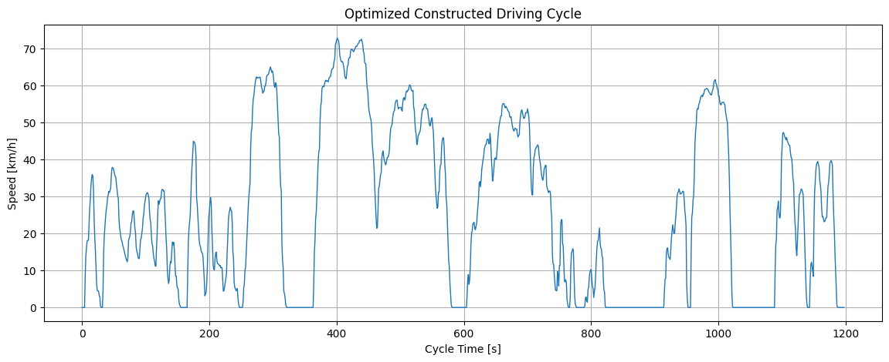
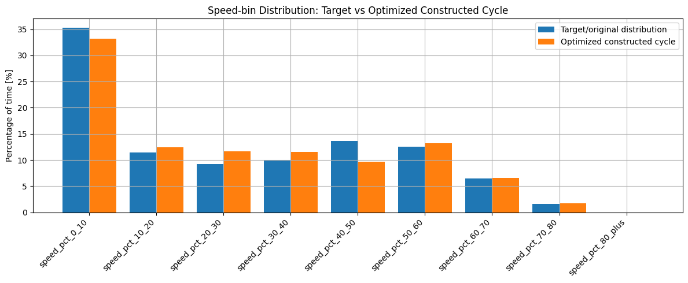

# Representative Driving Cycle Construction from VED Data

This repository contains a Python pipeline for constructing a representative driving cycle from real-world vehicle speed-time data. The pipeline follows a microtrip-based workflow with 1 Hz resampling, acceleration cleanup, idle/moving segmentation, feature extraction, PCA, K-means clustering, and optimized microtrip subset selection.

The objective is to convert raw vehicle trajectory data into a compact speed-time driving cycle that preserves the main driving characteristics of the original data, including mean speed, moving speed, idle percentage, acceleration/deceleration behavior, cruise behavior, and speed-bin distribution.

---

## Research overview

Driving cycles are widely used in vehicle energy analysis, emissions estimation, traffic-behavior studies, powertrain testing, and simulation work. A useful representative driving cycle should be shorter than the original raw driving record while still preserving the important statistical behavior of the source trip.

This repository implements a complete drive-cycle construction pipeline:

```text
Raw VED-style CSV
→ column standardization
→ 1 Hz resampling
→ acceleration cleaning
→ idle/moving run detection
→ microtrip segmentation
→ feature extraction
→ PCA
→ K-means clustering
→ optimized microtrip subset selection
→ final representative driving cycle
```

The current demonstration constructs a 1198-second optimized representative driving cycle with a target duration of 1200 seconds.

---

## Dataset and attribution

This research uses the processed driving-cycle dataset from:

SFIEssential, **VED-Driving-Cycle-Dataset**  
https://github.com/SFIEssential/VED-Driving-Cycle-Dataset

The dataset used here was not collected or created in this repository. It comes from the SFIEssential VED-Driving-Cycle-Dataset repository, which provides processed driving-cycle data derived from the Vehicle Energy Dataset (VED). According to the SFIEssential repository, the data processing focused on extracting driving-cycle records from VED, mainly for EV and PHEV trips, with a minimum cycle duration of 1800 seconds. The processed files include timestamp, latitude, longitude, vehicle speed, and elevation information.

The SFIEssential repository states that elevation was added using latitude and longitude through Open Topo Data.

Original processed dataset repository:

https://github.com/SFIEssential/VED-Driving-Cycle-Dataset

Upstream VED dataset reference:

G. S. Oh, D. J. LeBlanc, and H. Peng,  
**Vehicle Energy Dataset (VED), A Large-scale Dataset for Vehicle Energy Consumption Research**  
IEEE DataPort / arXiv:1905.02081  
https://arxiv.org/abs/1905.02081

Important note:

This repository does not claim ownership of the SFIEssential VED-Driving-Cycle-Dataset or the original Vehicle Energy Dataset. Raw data is not included in this repository. Users should download the data from the original processed dataset source and cite both the processed dataset repository and the upstream VED dataset when appropriate.

---

## Input data format

The pipeline expects a CSV file with VED-style columns:

```text
VehId
Trip
Timestamp(s)
Latitude[deg]
Longitude[deg]
Vehicle Speed[km/h]
elevation[m]
```

Example local input path:

```text
data/cycle_v1.csv
```

Raw input data files are not tracked in this repository. The `.gitignore` file excludes local CSV data files and generated output folders.

---

## Methodology

### 1. Data loading and column standardization

The input CSV is loaded and the VED column names are mapped into simpler internal names:

```text
VehId → veh_id
Trip → trip_id
Timestamp(s) → time_s
Latitude[deg] → lat
Longitude[deg] → lon
Vehicle Speed[km/h] → speed_kmh
elevation[m] → elevation_m
```

Rows with missing or non-numeric required values are removed. The data is then sorted by vehicle ID, trip ID, and timestamp.

---

### 2. 1 Hz resampling

VED speed data may have irregular timestamp intervals. For drive-cycle construction, the trip is resampled to 1 Hz using linear interpolation. This creates a uniform time base where each row represents one second of driving.

---

### 3. Acceleration cleanup

Acceleration is calculated from the 1 Hz speed profile. Basic physical limits are then applied to remove unrealistic spikes:

```text
Maximum acceleration: +4.0 m/s²
Maximum deceleration: -8.0 m/s²
```

This prevents timestamp noise or interpolation artifacts from affecting segmentation and feature extraction.

---

### 4. Idle and moving-state detection

A point is treated as idle when:

```text
speed <= 1 km/h
```

This threshold is more robust than checking for exact zero speed, since real vehicle signals often contain small noise around zero.

The speed-time series is then divided into continuous idle and moving runs.

---

### 5. Microtrip segmentation

A microtrip is defined as:

```text
one moving run + the following idle run
```

Very small or uninformative fragments are removed using simple validity checks:

```text
Minimum microtrip duration: 10 s
Maximum idle duration inside microtrip: 180 s
Minimum maximum speed: 10 km/h
Minimum distance: 0.01 km
```

This gives a set of usable driving segments for clustering and final cycle construction.

---

### 6. Feature extraction

Each valid microtrip is represented by driving-behavior features:

```text
duration
distance
maximum speed
mean speed
mean moving speed
speed standard deviation
idle percentage
acceleration percentage
deceleration percentage
cruise percentage
mean positive acceleration
mean absolute deceleration
acceleration standard deviation
speed-bin percentages
```

The driving-mode percentages are mutually exclusive:

```text
idle + acceleration + deceleration + cruise = 100%
```

Speed-bin percentages are computed using these bins:

```text
0–10 km/h
10–20 km/h
20–30 km/h
30–40 km/h
40–50 km/h
50–60 km/h
60–70 km/h
70–80 km/h
80+ km/h
```

---

### 7. PCA and K-means clustering

The extracted microtrip features are standardized and reduced using Principal Component Analysis (PCA). K-means clustering is then applied in PCA space. For the current demonstration, three clusters are used:

```text
low_speed
medium_speed
high_speed
```

Cluster names are assigned based on the average moving speed of each cluster.

---

### 8. Optimized microtrip selection

The final representative cycle is built by selecting a subset of valid microtrips. The selection objective tries to match:

```text
target cycle duration
mean speed
mean moving speed
speed standard deviation
idle / acceleration / deceleration / cruise percentages
speed-bin distribution
cluster duration proportions
acceleration/deceleration characteristics
```

For small candidate sets, the script uses exhaustive subset search. For larger candidate sets, it can fall back to random subset search. The current demonstration uses exhaustive subset search because the number of candidate microtrips is small enough to search directly.

---

### 9. Final cycle stitching

The selected microtrips are stitched together in chronological order. A short initial idle period is added so the cycle starts from rest. After stitching, transition acceleration is checked and cleaned again using the same acceleration bounds.

The final output is a clean speed-time cycle ready for analysis or simulation.

---

## How to run

Install dependencies:

```bash
pip install -r requirements.txt
```

Run the pipeline:

```bash
python drive_cycle_pipeline.py --input path/to/cycle_v1.csv --output outputs --target-duration 1200
```

Useful optional arguments:

```bash
python drive_cycle_pipeline.py \
  --input path/to/cycle_v1.csv \
  --output outputs \
  --target-duration 1200 \
  --idle-speed-kmh 1.0 \
  --n-clusters 3 \
  --n-pcs 4
```

---

## Main output files

The pipeline writes output files to the selected output folder. Important outputs:

```text
FINAL_optimized_representative_drive_cycle.csv
```

Final simplified speed-time cycle with time, speed, acceleration, and source microtrip information.

```text
optimized_drive_cycle_full.csv
```

Full final cycle with additional metadata, original timestamp references, and segment labels.

```text
key_feature_comparison.csv
```

Comparison between the target driving characteristics and the optimized constructed cycle.

```text
optimized_selected_microtrips.csv
```

Microtrips selected for the final representative cycle.

```text
microtrip_features.csv
```

Extracted feature table for all valid microtrips.

```text
microtrip_clusters.csv
```

Microtrip features with PCA coordinates and K-means cluster labels.

```text
cluster_summary.csv
```

Summary of low-speed, medium-speed, and high-speed microtrip clusters.

```text
top_search_results.csv
```

Best candidate microtrip subsets ranked by optimization score.

```text
run_summary.json
```

Compact summary of the full pipeline run.

---

## Key result

The optimized final cycle closely matches the target driving statistics.

| Feature | Target | Optimized constructed | Absolute error | Percent error |
|---|---:|---:|---:|---:|
| Duration (s) | 1200.000 | 1198.000 | -2.000 | -0.167% |
| Distance (km) | 8.762 | 8.726 | -0.037 | -0.417% |
| Maximum speed (km/h) | 74.650 | 72.900 | -1.750 | -2.344% |
| Mean speed (km/h) | 26.286 | 26.220 | -0.066 | -0.251% |
| Mean moving speed (km/h) | 34.977 | 34.968 | -0.009 | -0.024% |
| Speed standard deviation (km/h) | 22.789 | 22.554 | -0.234 | -1.029% |
| Idle time (%) | 24.875 | 25.042 | 0.167 | 0.670% |
| Acceleration time (%) | 29.373 | 29.633 | 0.260 | 0.886% |
| Deceleration time (%) | 28.373 | 28.631 | 0.258 | 0.909% |
| Cruise time (%) | 17.379 | 16.694 | -0.685 | -3.940% |
| Mean positive acceleration (m/s²) | 0.674 | 0.678 | 0.004 | 0.607% |
| Mean deceleration magnitude (m/s²) | 0.674 | 0.673 | -0.001 | -0.083% |
| Acceleration standard deviation (m/s²) | 0.716 | 0.706 | -0.010 | -1.453% |

Compact summary:

```text
Target duration: 1200 s
Final duration: 1198 s
Mean speed error: 0.25%
Moving mean speed error: 0.02%
Distance error: 0.42%
Idle percentage error: 0.67%
Acceleration percentage error: 0.89%
Deceleration percentage error: 0.91%
```

---

## Optimized constructed driving cycle

The final representative cycle is a 1198-second speed-time profile. It preserves the main stop-and-go, medium-speed, and higher-speed portions of the original data while reducing the raw trip into a compact representative cycle.


```text
assets/optimized_constructed_driving_cycle.png
```



Figure interpretation:

- The cycle starts with a short idle period.
- Several stop-and-go segments appear in the low-speed and medium-speed regions.
- Higher-speed portions are retained around the middle and later parts of the cycle.
- The final cycle remains close to the 1200-second target duration while maintaining the main speed-time behavior of the original trip.

---

## Speed-bin distribution

The speed-bin comparison shows how closely the optimized cycle matches the target/original distribution across different speed ranges.


```text
assets/speed_bin_distribution.png
```




Figure interpretation:

- The low-speed 0–10 km/h region is captured reasonably well.
- The 50–80 km/h portions are also represented well overall.
- The main remaining mismatch appears in the 20–50 km/h range.
- The constructed cycle slightly overrepresents 20–40 km/h and underrepresents 40–50 km/h.
- This is expected for a single-trip demonstration with a limited number of candidate microtrips.

---

## Repository structure

```text
AI_based_drive-cycle-construction/
│
├── drive_cycle_pipeline.py
├── requirements.txt
├── README.md
├── LICENSE
├── .gitignore
│
└── assets/
    ├── optimized_constructed_driving_cycle.png
    └── speed_bin_distribution.png
```

Raw input data and generated output files are not included in this repository. Users should download the dataset separately and provide the local CSV path when running the pipeline.

---

## Scope and limitations

This repository is intended as a reproducible research-code pipeline for representative driving-cycle construction. Current limitations:

- The demonstration result is based on one VED-style trip file.
- The pipeline is designed to scale to more trips, where clustering and microtrip diversity should improve.
- The current implementation uses PCA, K-means clustering, and exhaustive subset optimization for representative microtrip selection.
- GPS coordinates are used mainly as part of the input structure and are not map-matched.
- The final cycle is intended for research and analysis, not for regulatory certification or official emissions/fuel-economy testing.
- Output quality depends on input trip diversity, threshold settings, and target duration.

---

## Relation to previous driving-cycle methods

This implementation follows the general idea of microtrip-based representative driving-cycle construction. The workflow is also influenced by clustering and optimization-based approaches used in previous drive-cycle studies.

This repository uses a clustering-based structure with exhaustive subset search for representative microtrip selection. For the current dataset size, exhaustive subset search is direct, reproducible, and sufficient.

---

## References

1. SFIEssential,  
   **VED-Driving-Cycle-Dataset**  
   GitHub repository.  
   https://github.com/SFIEssential/VED-Driving-Cycle-Dataset

2. G. S. Oh, D. J. LeBlanc, and H. Peng,  
   **Vehicle Energy Dataset (VED), A Large-scale Dataset for Vehicle Energy Consumption Research**  
   arXiv:1905.02081.  
   https://arxiv.org/abs/1905.02081

3. Minrui Zhao, Hongni Gao, Qi Han, Jiaang Ge, Wei Wang, and Jue Qu,  
   **Development of a Driving Cycle for Fuzhou Using K-Means and AMPSO**  
   Journal of Advanced Transportation, 2021.  
   DOI: 10.1155/2021/5430137  
   https://onlinelibrary.wiley.com/doi/10.1155/2021/5430137

4. Yongjiang He,  
   **Research on the construction method of vehicle driving cycle based on Mean Shift clustering**  
   arXiv:2008.05070.  
   https://arxiv.org/abs/2008.05070

---

## License

The code in this repository is released under the MIT License. The VED dataset is not owned by this repository. Please follow the original dataset license and citation requirements from the official VED source.
